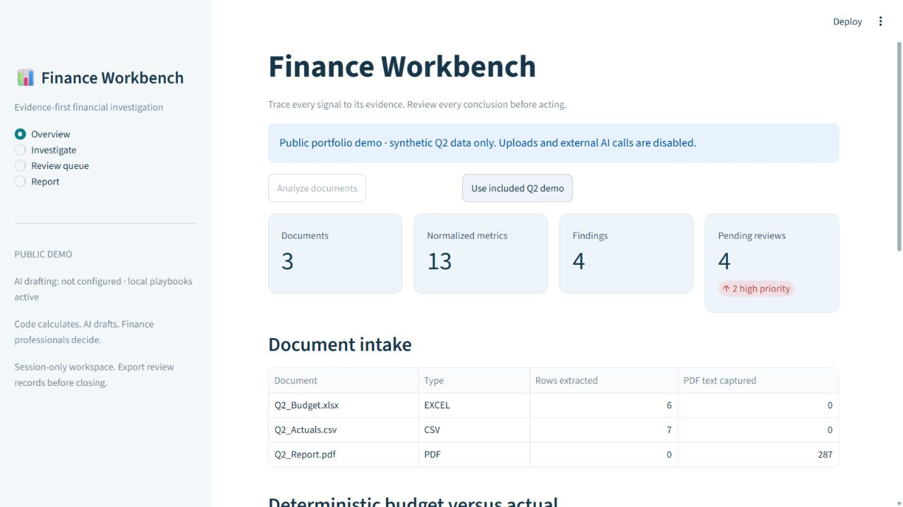

# Finance Workbench

[](https://github.com/animeshpthk07/Finance-Workbench/actions/workflows/quality.yml)

An evidence-first workspace for finance teams to investigate source documents, calculate financial signals, and prepare review-ready explanations.

> Calculations are deterministic. The optional AI step produces a clearly labelled draft. Every finding requires human review.

[Open the live demo](https://finance-workbench-otea96uvyvjtkud27u4a9k.streamlit.app/) · [90-second walkthrough](docs/PORTFOLIO.md) · [Validation record](docs/PROJECT_VALIDATION.md)



[Evidence and interpretation screenshot](docs/screenshots/investigation.png)

## What it does

`Upload → Parse → Normalize → Calculate → Detect → Link evidence → Investigate → Explain → Review`

- Reads CSV, XLSX/XLS, and searchable PDF documents.
- Compares budget and actual data with traceable variance calculations; forecast-named files are treated as the budget baseline, not as a separate forecasting engine.
- Detects material variances, missing values, duplicate source rows, and statistical outliers.
- Links each signal to source rows and relevant PDF excerpts.
- Produces a deterministic investigation playbook; an OpenAI draft is available only after explicit configuration.
- Provides a professional Streamlit workbench, human review queue, and downloadable Markdown report draft.
- Exports review status, reviewer notes, source evidence and investigations as Markdown or JSON.
- Flags unmatched reporting periods without pretending missing data is zero; keeps currencies and entities separate.

## Quick start

```bash
python -m venv .venv
.venv\Scripts\activate  # Windows
pip install -r requirements.txt
streamlit run app.py
```

Use the included `Q2_Actuals.csv`, `Q2_Budget.xlsx`, and `Q2_Report.pdf` to explore the demo workflow.

## Optional AI investigation draft

The application stays deterministic during analysis. On a private/local deployment, configure both environment values to make a separate, consent-gated AI draft button available:

```bash
OPENAI_API_KEY=your_key
FINANCE_WORKBENCH_AI_MODEL=your_model
```

Facts and cited evidence remain separate from model interpretation. The app does not submit transactions, change records, or make autonomous finance decisions.

The anonymous public demo uses synthetic data with uploads and external AI disabled. See [deployment and secret handling](docs/DEPLOYMENT.md) for local uploads, optional AI, request limits and hosting instructions. A live paid model request is not part of the automated test results.

## Quality and documentation

- [Architecture](docs/ARCHITECTURE.md)
- [Validation and reliability](docs/VALIDATION.md)
- [Project validation record](docs/PROJECT_VALIDATION.md)
- [Deployment](docs/DEPLOYMENT.md)
- [Portfolio and LinkedIn draft](docs/PORTFOLIO.md)

Release checks: **26 tests passed**, including four-page Streamlit navigation and review exports; **6/6 synthetic evaluation scenarios passed**. These are software checks, not measured real-world detection accuracy.

Run checks locally:

```bash
pytest -q
python evaluation.py
```

## Project structure

```text
app.py                    Streamlit analyst workbench
backend/ingestion.py      CSV, Excel, and PDF parsing
backend/normalization.py  Transparent column mapping
backend/pipeline.py       End-to-end deterministic workflow
backend/investigator.py   Evidence-grounded investigation drafts
backend/reporting.py      Review-ready Markdown report
backend/models/           Typed finance records and evidence contracts
evaluation.py             Portable reliability scenarios
```

## Boundaries

This is a decision-support prototype, not an accounting system or audit opinion. Validate all findings against the linked source evidence before acting. Excel parsing reads the first sheet; PDFs must contain searchable text. Review state is session-only: export before closing. No OCR, authenticated multi-user review database, currency conversion or representative real-world accuracy benchmark is included.
