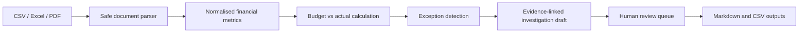

# Finance Workbench — Validation & Portfolio Guide

## Architecture



## Six-phase delivery checklist

| Phase | Delivered evidence |
|---|---|
| AI investigator | Evidence-linked draft and human-review flag for each detected exception. |
| End-to-end pipeline | Upload → parse → calculate → detect → evidence → investigate → review → export. |
| Real financial documents | CSV, XLS/XLSX and PDF ingestion; Q2 demo documents are included. |
| Professional workbench | Streamlit interface with Overview, Investigation, Review and Export views. |
| Evaluation & reliability | Deterministic variance tests in `test_workbench.py`; complete Colab run produced 7 passing tests. |
| Recruiter polish | Public README, architecture diagram, demo inputs, reproducible instructions and focused commit history. |

## Run locally

```bash
pip install -r requirements.txt
streamlit run app.py
pytest -q
```

## What to demonstrate

1. Select **Use included Q2 sample files** in the sidebar.
2. Review budget-versus-actual variances and evidence links.
3. Mark investigation drafts as confirmed, dismissed or requiring follow-up.
4. Download the Markdown report and variance CSV.

## Reliability principles

- Calculations are deterministic and traceable to source files and rows.
- PDF extraction is treated as evidence, not a final financial conclusion.
- Investigation text is a review draft; a finance professional retains final decision authority.
- The application does not send uploaded financial documents to an external service.
