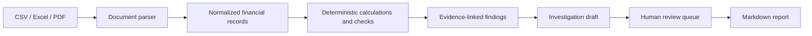

# Finance Workbench — Validation and Demo Guide

## Verified publication

The application published in commit `1356de4` was downloaded from GitHub and checked on 21 September 2026 using Python 3.12 and Streamlit 1.64.

- Regression suite: **13 passed**.
- Portable evaluation: **6 of 6 scenarios passed**.
- Streamlit app: all four pages ran without exceptions after loading the included demo.
- Demo result: 3 documents, 13 normalized metrics, 3 findings, and 1 linked PDF excerpt.
- Review checkbox: updates the pending review queue.
- Markdown report: generated successfully and exposes a download control.

The optional model integration was tested with a simulated response and a simulated outage. A live paid model request was not run.

## Architecture



## Delivered scope and remaining limits

| Phase | Implemented in this release | Limits |
|---|---|---|
| AI investigator | Evidence, hypotheses, verification checks, optional OpenAI draft and local fallback | Live model credentials and real-case evaluation are still needed for operational use |
| End-to-end pipeline | Upload, parse, normalize, calculate, detect, evidence, investigate, explain, review and report | Review state remains in the current Streamlit session |
| Financial documents | CSV, Excel and searchable PDF support; included Q2 sample documents | PDF text is supporting evidence; scanned PDFs need OCR outside this version; Excel ingestion reads the first sheet |
| Workbench | Overview, Investigate, Review queue and Report pages | No multi-user account system or durable review database |
| Evaluation | 13 regression tests, 6 deterministic scenarios and four-page app check | These checks are not a measured accuracy benchmark on a representative real-world corpus |
| Project presentation | README, architecture, demo files, validation guide and Dockerfile | Screenshots, hosted public demo and LinkedIn presentation are separate follow-up work |

## Reproduce

```bash
pip install -r requirements.txt
python -m pytest -q
python evaluation.py
streamlit run app.py
```

## Demo walkthrough

1. Click **Use included Q2 demo** below the upload control.
2. Inspect document intake and budget-versus-actual results on **Overview**.
3. Open **Investigate** and verify the cited rows, PDF excerpt, hypotheses and suggested checks.
4. Use **Review queue** to mark a finding reviewed and record a note for the current session.
5. Open **Report** and download the Markdown draft. Reviewer notes are not included in the current export.

## Data handling

The default route processes documents locally. If both `OPENAI_API_KEY` and `FINANCE_WORKBENCH_AI_MODEL` are configured, analysis sends finding descriptions and selected evidence snippets to OpenAI for draft interpretation. Only enable that option for data approved for that destination. Every result remains subject to human review.
