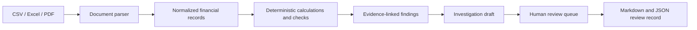

# Finance Workbench — Validation and Demo Guide

## Verified publication

The release was prepared from published commit `639b1ab` and checked on 21 September 2026 using Python 3.12 and Streamlit 1.64.

- Regression suite: **26 passed**, including app navigation and public-demo safeguards.
- Portable evaluation: **6 of 6 scenarios passed**.
- Streamlit app: all four pages ran without exceptions after loading the included demo.
- Demo result: 3 documents, 13 normalized metrics, 4 findings, and 2 linked PDF excerpts. The findings are a possible duplicate, a material Travel variance, and two unmatched Salaries reporting-period comparisons. Missing counterparts are not represented as zero.
- Review checkbox: updates the pending review queue.
- Markdown and JSON exports: include review status, notes, investigation drafts and source evidence.

The optional model integration was tested with simulated success, outage and malformed outputs, plus a mocked SDK request that verifies timeout, token cap, structured JSON and `store=False`. Normal analysis is tested to make no external AI calls even when credentials are configured. A live paid model request was not run because no API credential/model was configured in the task environment.

## Architecture



## Delivered scope and remaining limits

| Phase | Implemented in this release | Limits |
|---|---|---|
| AI investigator | Evidence, hypotheses, verification checks, optional OpenAI draft and local fallback | Live model credentials and real-case evaluation are still needed for operational use |
| End-to-end pipeline | Upload, parse, normalize, calculate, detect, evidence, investigate, explain, review and export notes/status | Review state remains in the current Streamlit session; downloaded records are not an authenticated audit log |
| Financial documents | CSV, Excel and searchable PDF support; included Q2 sample documents | PDF text is supporting evidence; scanned PDFs need OCR outside this version; Excel ingestion reads the first sheet |
| Workbench | Overview, Investigate, Review queue and Report pages | No multi-user account system or durable review database |
| Evaluation | 26 regression tests, 6 deterministic scenarios and four-page app check | These checks are not a measured accuracy benchmark on a representative real-world corpus |
| Project presentation | README, architecture, demo files, deployment guide, Docker recipe, screenshots and LinkedIn presentation draft | LinkedIn publishing remains the owner's choice; Docker daemon execution was not tested |

## Reproduce

```bash
pip install -r requirements.txt
python -m pytest -q
python evaluation.py
streamlit run app.py
```

## Demo walkthrough

1. Click **Use included Q2 demo** below the upload control.
2. Inspect document intake and budget-versus-actual results on **Overview**.
3. Open **Investigate** and verify the cited rows, PDF excerpt, hypotheses and suggested checks.
4. Use **Review queue** to mark a finding reviewed and record a note for the current session.
5. Open **Report** and download Markdown or JSON. Reviewer notes and status are included in both exports.

## Data handling

Documents are processed on the app's hosting machine. Analysis never calls the external model. On a configured private/local instance, the reviewer can authorize a separate per-finding OpenAI request after inspecting its prompt. Public-demo mode disables uploads and model requests. Only use approved data for the selected host and destination. Every result remains subject to human review.
